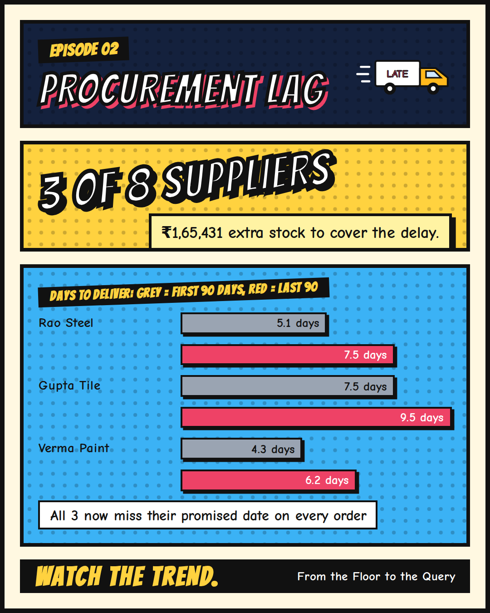
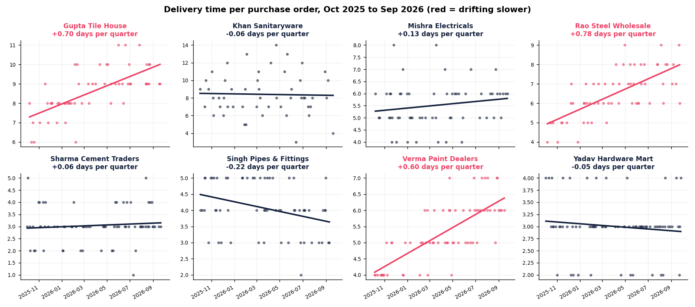

[← Back to all episodes](../README.md)

# Episode 2: Procurement Lag



## The business problem
You set a reorder point assuming a supplier delivers in, say, 5 days. If that supplier quietly drifts to 7 or 8 days, the
reorder point is now wrong, and the shelf runs empty before the new stock arrives. The average lead time barely moves, so
nobody notices. The trend is what gives it away. A paper register records what arrived, not how long it took.

## The question
Which suppliers are getting slower, by how much, and what extra stock does that force you to hold?

## Approach
1. Lead time per order = received date minus order date. Late = lead time above the supplier's promised days.
2. For each supplier, fit a straight line of lead time against order date (linear regression, `scipy.stats.linregress`).
3. The slope is the drift, in days per quarter. The p-value says whether the drift is real or just noise.
4. Flag a supplier only if the drift is both **real** (p < 0.01) and **big enough to matter** (0.5+ days per quarter).
5. Size the impact: extra days of lead time x average rupees bought per day = extra stock you must hold.

## Results (synthetic data, 8 suppliers, 495 purchase orders, Oct 2025 to Sep 2026)
- **3 of 8 suppliers are drifting slower**: Rao Steel, Gupta Tile and Verma Paint.
- Rao Steel went from **5.1 to 7.5 days** between the first and last 90 days.
- All three now deliver late on every order in the last 90 days.
- The extra stock buffer they force you to hold: **Rs 1,65,431**.

| Supplier | Orders | First 90 days | Last 90 days | Slope (days per quarter) | p-value | Late (last 90 days) | Extra buffer (Rs) | Drifting |
|---|---|---|---|---|---|---|---|---|
| Rao Steel Wholesale | 61 | 5.1 days | 7.5 days | +0.78 | <0.001 | 100% | 99,111 | **Yes** |
| Gupta Tile House | 57 | 7.5 days | 9.5 days | +0.70 | <0.001 | 100% | 35,169 | **Yes** |
| Verma Paint Dealers | 66 | 4.3 days | 6.2 days | +0.60 | <0.001 | 100% | 31,151 | **Yes** |
| Mishra Electricals | 58 | 5.5 days | 5.8 days | +0.13 | 0.194 | 69% | 1,900 | No |
| Sharma Cement Traders | 69 | 3.1 days | 3.2 days | +0.06 | 0.440 | 25% | 868 | No |
| Yadav Hardware Mart | 72 | 3.1 days | 2.9 days | -0.05 | 0.346 | 16% | -661 | No |
| Khan Sanitaryware | 51 | 8.4 days | 8.1 days | -0.06 | 0.846 | 27% | -3,274 | No |
| Singh Pipes & Fittings | 61 | 4.2 days | 3.6 days | -0.22 | 0.010 | 7% | -6,153 | No |



## Files
| File | What it is |
|---|---|
| `python/procurement_lag.py` | The analysis (regression per supplier, flags, impact) |
| `python/make_chart.py` | Draws `lag_trends.png` |
| `python/lag_summary.csv` | The results table above |
| `data/purchase_orders.csv` | 495 synthetic purchase orders |
| `generate_data.py` | Rebuilds the dataset (seeded, repeatable) |
| `lag_trends.png`, `cover.png` | Chart and episode cover |

## How to run
```bash
pip install pandas scipy matplotlib
cd episode-2
python python/procurement_lag.py
python python/make_chart.py
```

## Limits to keep in mind
- **A straight line is a simplification.** A supplier that got slower in a step (a new warehouse, a strike) is not a smooth trend.
- **Significant is not the same as big.** Mishra Electricals drifts +0.13 days per quarter, which is too small to act on. Singh Pipes is getting faster. Neither is flagged.
- **Volatile is not drifting.** Khan Sanitaryware swings from 3 to 14 days but has no trend. That needs a bigger safety stock, not a trend alert.
- **Rupees bought per day stands in for rupees sold per day.** Real demand data would sharpen the buffer figure.
- **Synthetic data.** Real purchase orders need cleaning (missing receipt dates, partial deliveries) first.

## Level up
Replace the straight line with a rolling 60-day average, so a sudden jump shows up within weeks instead of months.
