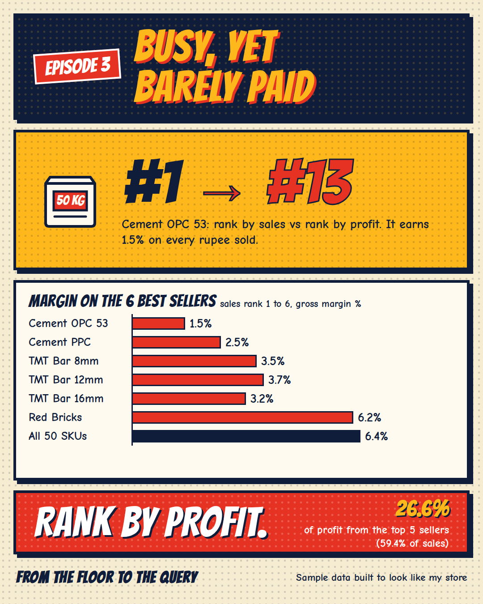
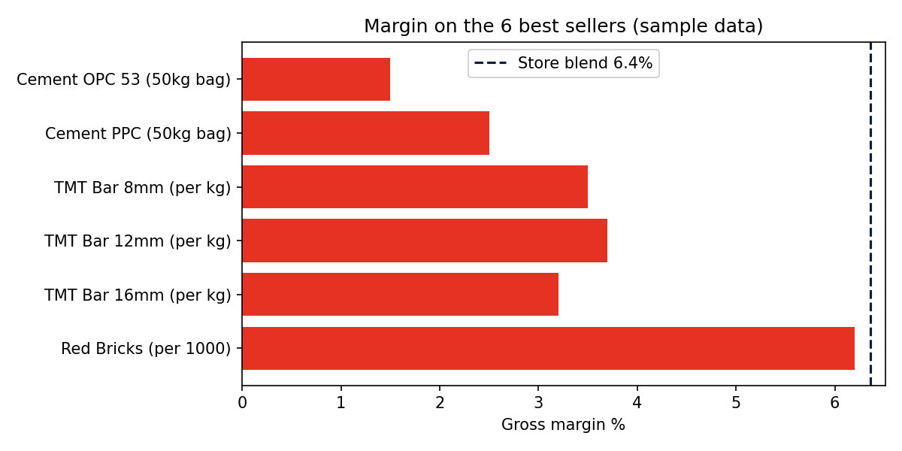

[← Back to all episodes](../README.md)

# Episode 3: Busy, Yet Barely Paid
**SKU-level margin with SQL (and a DAX version)**



> All data here is synthetic: a sample dataset I built to look like a building-materials store. No real store records.

## The problem
A busy shelf feels like a good shelf. But revenue rank and profit rank are different lists, and the gap between them is where money hides.

## The question
Which SKUs earn the store its profit, and which ones just move volume?

## Approach
1. Join sales lines to SKU cost price. Revenue = qty x unit price (discounts already included). COGS = qty x cost price.
2. Gross profit = revenue - COGS, then margin % = profit / revenue, per SKU.
3. Rank every SKU twice with window functions: once by revenue, once by profit.
4. Add a running share of total profit to see how many SKUs carry the store.

## Results (180 days to 30 Sep 2026, 50 SKUs, 2,882 sale lines)
- Revenue ₹1,96,40,531. Gross profit ₹12,49,092. Blended margin 6.4%.
- **Cement OPC 53**: #1 by revenue (₹24,71,724), #13 by profit (₹37,539), margin 1.5%. About ₹5.63 profit per 50kg bag.
- The top 5 SKUs by revenue bring 59.4% of revenue but 26.6% of profit. All five are below the 6.4% blend.
- **Red Bricks**: #6 by revenue, #1 by profit (₹1,13,446, margin 6.2%).
- 19 of 50 SKUs produce 80% of profit.



Full table: `results/sku_margin.csv`.

## Files
- `generate_data.py`: seeded generator (seed 2026)
- `data/skus.csv`, `data/sales_lines.csv`
- `sql/sku_margin.sql`: the analysis
- `python/run_sql.py`: runs the SQL on the CSVs with DuckDB; `python/plot_ranks.py`: chart
- `dax/sku_margin_measures.dax`: Power BI measures (**not run**, see Limits)
- `results/`: output table and chart

## How to run
```
pip install pandas numpy duckdb matplotlib
python generate_data.py
python python/run_sql.py
python python/plot_ranks.py
```

## Limits
- Synthetic data. Cost price is one fixed number per SKU; real costs move with each purchase.
- Gross margin ignores rent, labour, transport and the cost of cash tied up in stock.
- The DAX measures were not executed. They were written and checked by logic, and the expected values to match in Power BI are listed at the top of the .dax file. The SQL was cross-checked against an independent pandas calculation (zero difference).
- Discounts are random in this dataset, so the exact ranks of close SKUs would shift with a different seed.

## Level up
Add margin by category, then by month, to see where discounting eats margin. Or flag SKUs where revenue rank is 10+ places better than profit rank.
